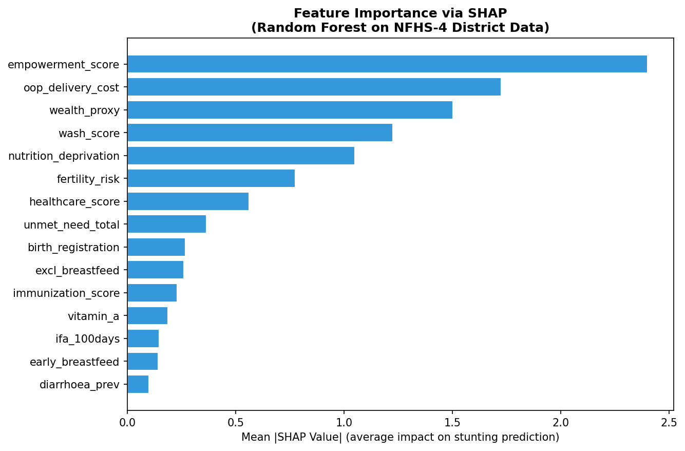
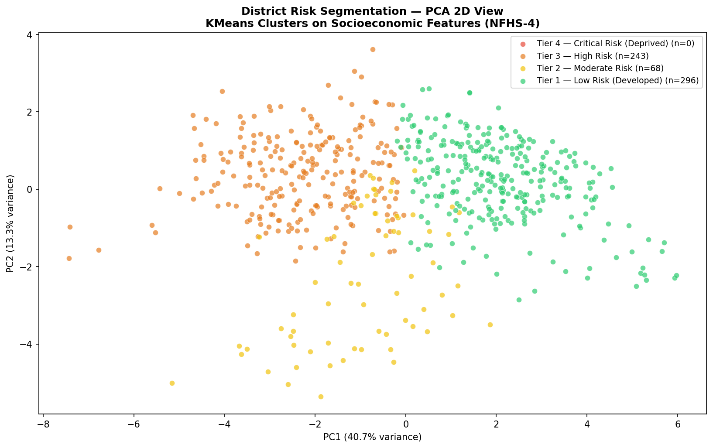
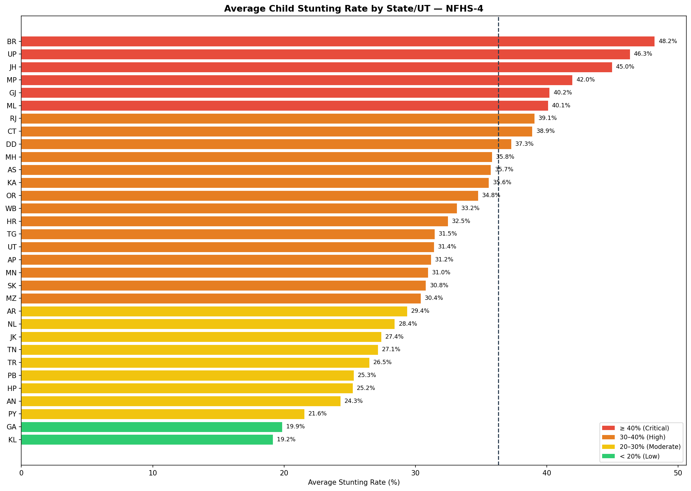

# District-Level Socioeconomic Risk Segmentation and Outcome Modeling
### National Family Health Survey — Round 4 (NFHS-4) | India | 2015–16

---

## Overview

This project applies regression modeling and unsupervised clustering to
district-level data from India's National Family Health Survey Round 4
(NFHS-4, 2015–16) to predict child stunting rates across 607 districts
and segment them into actionable risk tiers based on socioeconomic
indicators.

The analysis is structured around a policy objective: identifying which
districts require urgent multi-sector intervention and what the primary
drivers of deprivation are in each tier.

---

## Problem Statement

Child stunting — defined as height-for-age below two standard deviations
of the WHO median — is the single most cited indicator of chronic poverty
and systemic deprivation. It reflects simultaneous failures across
nutrition, sanitation, education, and healthcare delivery.

This project treats stunting as a regression target and models it as a
function of district-level socioeconomic conditions, with the goal of
producing district-specific risk profiles and policy recommendations.

**Key finding:** 243 of 607 districts (40%) fall into the high-risk tier.
Women's education emerges as the single strongest predictor of child
stunting, with a SHAP importance of 2.40 — more than twice that of the
next feature.

---

## Data Source

| Field        | Details |
|---|---|
| Survey       | National Family Health Survey, Round 4 |
| Year         | 2015–16 |
| Unit         | District level |
| Coverage     | 607 districts, 29 States and Union Territories |
| Indicators   | 93 indicators across 12 thematic domains |
| Source       | International Institute for Population Sciences (IIPS) |
| URL          | http://rchiips.org/nfhs/factsheet_NFHS-4.shtml |

The raw data is not tracked in this repository. Download the district
factsheet Excel file from the IIPS portal and place it at
`Data/raw/india-nfhs4-final.xlsx` before running the notebooks.

---

## Project Structure

```
nfhs4-district-risk-model/
│
├── data/
│   ├── raw/                        # Original NFHS-4 Excel (not tracked)
│   ├── processed/                  # Cleaned and engineered datasets
│
├── notebooks/
│   ├── 1_Data_cleaning.ipynb
│   ├── 2_EDA_and_visualization.ipynb
│   ├── 3_Feature_engineering.ipynb
│   ├── 4_Regression_modeling.ipynb
│   ├── 5_Clustering_segmentation.ipynb
│   └── 6_Policy_interpretation.ipynb
│
├── outputs/
│   ├── figures/
│   ├── models/
│   └── reports/
│
├── requirements.txt
├── .gitignore
└── README.md
```

---

## Setup

```bash
git clone https://github.com/your-username/nfhs4-district-risk-model.git
cd nfhs4-district-risk-model

python -m venv venv
source venv/bin/activate

pip install -r requirements.txt
```

Run notebooks in order from `01` through `06` using `jupyter lab`.

---

## Methodology

### Data Cleaning

The NFHS-4 district factsheet is structured as a multi-row merged Excel
file with three repeating blocks of 93 indicators each, representing
Total, Urban, and Rural splits. The Total block was retained for modeling.

Key steps:
- Parsed and standardized multi-row merged headers
- Replaced government suppression markers (`*`, `**`, `--`) with NaN
- Applied state-level median imputation rather than global median, given
  the strong regional variation inherent in NFHS data
- Final cleaned dataset: 607 rows, 93 columns

### Feature Engineering

Seven composite domain scores were constructed from the raw indicators
to reduce dimensionality, improve interpretability, and capture
policy-relevant groupings:

| Composite Score        | Components                                          |
|------------------------|-----------------------------------------------------|
| empowerment_score      | Women's literacy, schooling, school attendance      |
| wash_score             | Improved sanitation, clean water, clean fuel        |
| healthcare_score       | ANC visits, institutional births, postnatal care    |
| wealth_proxy           | Electricity access, clean fuel, health insurance    |
| nutrition_deprivation  | Women's low BMI, anaemia rates                      |
| fertility_risk         | Child marriage, teenage pregnancy, age structure    |
| immunization_score     | BCG, polio, DPT, measles vaccine coverage           |

VIF analysis confirmed structural multicollinearity across all composite
scores (VIF > 50 for most). This is expected behavior in socioeconomic
data — districts that are deprived score poorly across all dimensions
simultaneously. Rather than dropping features, Ridge Regression and
Random Forest were selected as models that handle collinearity natively.

### Regression Modeling

Four models were trained and evaluated on an 80/20 train-test split with
5-fold cross-validation:

| Model               | R²    | RMSE  | CV R² (mean) | CV R² (std) |
|---------------------|-------|-------|--------------|-------------|
| Linear Regression   | 0.671 | 5.991 | 0.561        | 0.045       |
| Ridge Regression    | 0.672 | 5.978 | 0.567        | 0.049       |
| Lasso Regression    | 0.674 | 5.963 | 0.571        | 0.048       |
| Random Forest       | 0.696 | 5.759 | 0.611        | 0.060       |

Random Forest was selected as the primary model. SHAP (TreeExplainer)
was used for interpretation in place of raw feature coefficients.

### Clustering and Segmentation

KMeans clustering was applied to the 15 scaled socioeconomic features.
K=3 was selected based on both the elbow method and silhouette analysis
(best silhouette score: 0.261 at K=3).

| Risk Tier                    | Districts | Mean Stunting |
|------------------------------|-----------|---------------|
| Tier 1 — Low Risk            | 296       | 30.8%         |
| Tier 2 — Moderate Risk       | 68        | 33.6%         |
| Tier 3 — High Risk           | 243       | 43.8%         |

Clusters were labeled by ranking mean stunting rate per cluster and
assigning policy-relevant tier names accordingly.

---

## Results

### SHAP Feature Importance (Random Forest)

| Rank | Feature               | Mean Absolute SHAP | Direction   |
|------|-----------------------|--------------------|-------------|
| 1    | empowerment_score     | 2.400              | Protective  |
| 2    | oop_delivery_cost     | 1.725              | Risk factor |
| 3    | wealth_proxy          | 1.502              | Protective  |
| 4    | wash_score            | 1.224              | Protective  |
| 5    | nutrition_deprivation | 1.049              | Risk factor |
| 6    | fertility_risk        | 0.776              | Risk factor |
| 7    | healthcare_score      | 0.561              | Protective  |
| 8    | unmet_need_total      | 0.365              | Risk factor |
| 9    | birth_registration    | 0.268              | Protective  |
| 10   | excl_breastfeed       | 0.261              | Protective  |

---

## Policy Recommendations

### Tier 3 — High Risk (243 districts, mean stunting 43.8%)

Primary deficit: Low women's empowerment, high fertility risk, poor WASH
access.

Recommended interventions:
- Scale girls' secondary education and female literacy programmes
- Strengthen enforcement of the Prohibition of Child Marriage Act
- Expand ICDS coverage — prioritize districts with Anganwadi gaps
- Accelerate Swachh Bharat Mission targets for sanitation and water
- Introduce conditional cash transfers tied to ANC completion and IFA
  adherence

Lead ministries: Women and Child Development, Health, Education,
Jal Shakti

### Tier 2 — Moderate Risk (68 districts, mean stunting 33.6%)

Primary deficit: Transitional districts with fragile gains and high
out-of-pocket delivery costs.

Recommended interventions:
- Strengthen JSY and JSSK to reduce out-of-pocket delivery expenditure
- Increase exclusive breastfeeding counselling at Anganwadi centres
- Improve immunization cold chain and last-mile delivery
- Address unmet family planning need through ASHA worker capacity building

Lead ministries: Health, Women and Child Development, Finance

### Tier 1 — Low Risk (296 districts, mean stunting 30.8%)

Primary deficit: Residual risk concentrated in tribal and urban-poor
pockets within otherwise developed districts.

Recommended interventions:
- Targeted nutritional surveillance in high-risk sub-populations
- Address residual anaemia among women and children
- Diet diversity programmes for children aged 6 to 23 months

Lead ministries: Health, NITI Aayog

---

## Output Files

| File                                         | Description                          |
|----------------------------------------------|--------------------------------------|
| Data/processed/nfhs4_final.csv               | Cleaned and imputed dataset          |
| Data/processed/nfhs4_features_ready.csv      | Engineered features with scaling     |
| Data/processed/nfhs4_final_segmented.csv     | Full dataset with cluster labels     |
| Outputs/reports/priority_districts.csv       | Top 30 priority districts by risk    |
| Outputs/models/rf_model.pkl                  | Saved Random Forest model            |
| Outputs/models/ridge_model.pkl               | Saved Ridge Regression model         |
| Outputs/models/kmeans_model.pkl              | Saved KMeans clustering model        |

---

## Visualizations





## Dependencies

```
pandas==2.1.4
numpy==1.26.3
scikit-learn==1.4.0
matplotlib==3.8.2
seaborn==0.13.1
shap==0.44.0
statsmodels==0.14.1
openpyxl==3.1.2
scipy==1.12.0
joblib==1.3.2
jupyterlab==4.1.0
```

---

## Limitations

- NFHS-4 data is cross-sectional and from 2015-16. Causal inference is
  not possible from this analysis.
- District boundaries have changed since 2015-16 due to bifurcations.
  This analysis uses the original NFHS-4 district definitions.
- Suppressed values (marked with asterisks in the original data) were
  imputed using state-level medians, which may introduce bias in small
  districts with sparse samples.
- Silhouette scores for K=3 (0.261) indicate moderate cluster separation,
  consistent with the continuous and overlapping nature of socioeconomic
  deprivation.

---

## License

This project uses publicly available government survey data published by
the International Institute for Population Sciences (IIPS) under the
National Family Health Survey programme. For academic and
non-commercial use only.

---

## Acknowledgements

International Institute for Population Sciences (IIPS), Mumbai —
NFHS-4 district factsheets.

Ministry of Health and Family Welfare, Government of India.

DHS Program — survey methodology and documentation.